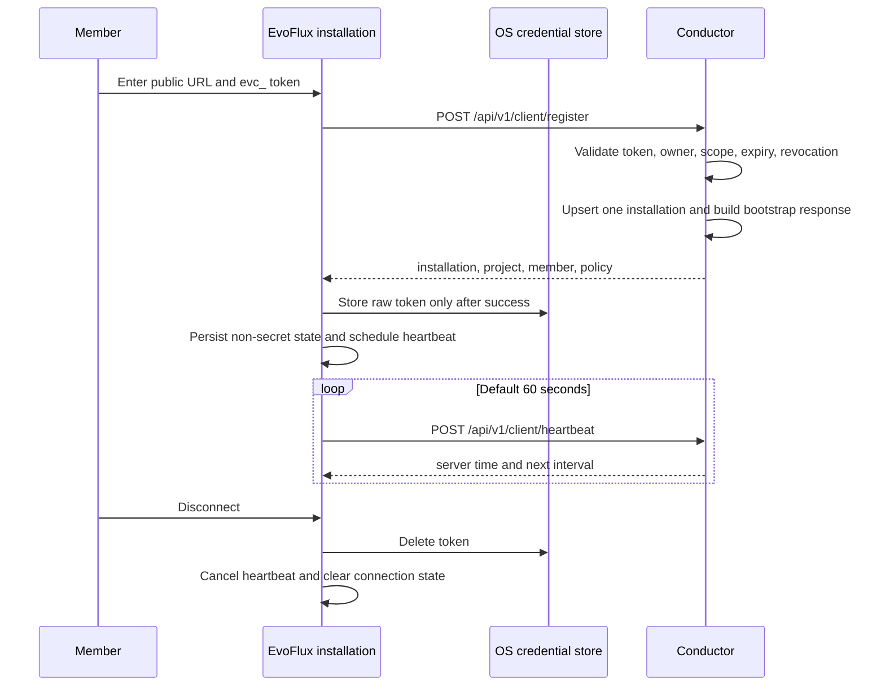

# DES-011 — Client registration and connection

| | |
|---|---|
| ID | DES-011 |
| Created | 2026-08-10 |
| Updated | 2026-08-10 |
| Status | Draft — as-built reconciliation; implementation PRs are in review |
| Requirement | [REQ-011](../requirement/12-REQ-011-client-registration.md) |
| References | [architecture.md](../architecture.md), [BASE-CONVENTIONS](../base/BASE-CONVENTIONS.md), [REQ-004](../requirement/02-REQ-004-api-authorization.md), [REQ-005](../requirement/07-REQ-005-member-lifecycle.md), [REQ-006](../requirement/08-REQ-006-connection-tokens.md), [REQ-015](../requirement/11-REQ-015-privacy-controls.md) |
| Tasks | [TSK-011-01](../task/12-REQ-011-client-registration/TSK-011-01-installation-storage.md) through [TSK-011-05](../task/12-REQ-011-client-registration/TSK-011-05-console-installations.md), all In Review under the recorded lifecycle exception |

> These documents were prepared before the normal lifecycle gate at the user's request. Implementation
> later proceeded by explicit user direction and is open in
> [evo-conductor#2](https://github.com/evoelsewhere/evo-conductor/pull/2) and
> [evoflux#4](https://github.com/evoelsewhere/evoflux/pull/4). This update records reality; it does **not**
> retroactively approve DES-011. REQ-011 was accepted by the project owner on 2026-08-10; design approval
> remains the next lifecycle decision before this design can be treated as approved.

## 1. Goal

Provide a reliable connection handshake between one EvoFlux desktop installation and the single project
workspace served by a Conductor deployment. The handshake proves the token owner's identity, creates or
refreshes exactly one installation record, returns safe bootstrap data, and keeps a lightweight last-seen
signal while EvoFlux is running.

This covers [REQ-011 acceptance criteria](../requirement/12-REQ-011-client-registration.md#4-acceptance-criteria).
It does not download resources, send inventory, or upload telemetry; those begin in REQ-012, REQ-013 and
REQ-014 only after registration succeeds.

## 2. Options considered

| Option | Advantages | Disadvantages | Outcome |
|---|---|---|---|
| Persist a random local installation key; Conductor issues the public installation ID | Stable across upgrades; no host fingerprint; server remains authoritative; supports idempotency | One non-secret local value | Selected |
| Derive identity from hostname, MAC address, or OS device ID | No local state file | Unstable, privacy-invasive, can collide or change | Rejected |
| Make every registration a new installation | Simple endpoint | Duplicates records on retry; member/device views become unreliable | Rejected |
| Treat resource subscription GET as enrolment | Works with the temporary V1 adapter | Cannot return identity/policy or record installation; GET must not mutate state | Rejected |

**Rationale:** EvoFlux creates a UUID once and persists it in its local runtime state. It is a
reconciliation key, not a credential or a machine identifier. Conductor uses it only within the project
workspace to find the installation, issues the canonical ID, and derives member/project entirely from
the bearer token and server configuration.

## 3. Connection lifecycle



Registration is synchronous so Settings can immediately report whether URL and token work. Heartbeat is an
additive background job: EvoFlux remains usable if Conductor is unreachable.

## 4. Data model changes

The current portable schema is in
[`migrate.rs`](../../crates/conductor-storage/src/migrate.rs). Add an append-only migration step there
until the project adopts versioned migrations. V1 has one project workspace represented by `instance.id`,
so the relationship is named `instance_id` rather than adding a second project table.

```sql
CREATE TABLE IF NOT EXISTS client_installations (
    id TEXT PRIMARY KEY NOT NULL,
    instance_id TEXT NOT NULL,
    user_id TEXT NOT NULL,
    installation_key TEXT NOT NULL,
    display_name TEXT NOT NULL,
    platform TEXT NOT NULL,
    evoflux_version TEXT NOT NULL,
    workspace_association TEXT,
    connected_at TEXT NOT NULL,
    last_seen_at TEXT NOT NULL,
    created_at TEXT NOT NULL,
    updated_at TEXT NOT NULL,
    UNIQUE(instance_id, installation_key)
);
CREATE INDEX IF NOT EXISTS idx_client_installations_user_seen
    ON client_installations(user_id, last_seen_at);
CREATE INDEX IF NOT EXISTS idx_client_installations_instance_seen
    ON client_installations(instance_id, last_seen_at);
```

| Field | Source and rule |
|---|---|
| `id` | Server-issued UUID; returned to EvoFlux and used by heartbeat. |
| `installation_key` | Client-generated UUID persisted locally; never calculated from host properties and never secret. |
| `user_id` | Token owner resolved server-side. The request has no user ID field. |
| `instance_id` | Configured project workspace resolved server-side. The request has no project ID field. |
| `display_name` | Bounded, user-editable label. Default is generic platform text such as `EvoFlux on macOS`, never hostname. |
| `workspace_association` | Optional opaque user label only; not an absolute path, repository name, file content or source code. |
| `last_seen_at` | Updated by successful registration and heartbeat; not an activity/usage measurement. |

`member_inventory` remains owned by REQ-013; it must not become an installation table. This requirement
stores no heartbeat event history: current last-seen time prevents a high-write audit log. Existing
deployments receive an empty table, so no data migration is required. Rollback disables routes; do not
drop the table while installations might still exist.

## 5. API changes

The existing token-protected subscription is
[`resources.rs`](../../crates/conductor-server/src/http/routes/resources.rs), mounted in
[`routes/mod.rs`](../../crates/conductor-server/src/http/routes/mod.rs). Extract its validation into a
reusable client-token extractor before adding the routes below.

| Method | Path | Authentication | Required scope | Description |
|---|---|---|---|---|
| POST | `/api/v1/client/register` | `Authorization: Bearer evc_…` | `subscribe_resources` | Validate/upsert an EvoFlux installation and return bootstrap information. |
| POST | `/api/v1/client/heartbeat` | `Authorization: Bearer evc_…` | `subscribe_resources` | Refresh last-seen only for an installation belonging to this token owner and instance. |

The token must also have an active owner and be unrevoked/unexpired. REQ-006 already defines
`subscribe_resources`; this design adds no overlapping `connect_client` scope.

### Register request and response

```http
Authorization: Bearer evc_…
Idempotency-Key: 0f0c5c95-0146-4b5b-942b-6c2fc9bdd4bc
Content-Type: application/json
```

```json
{
  "installation_key": "84ed6098-9f95-4ece-b2c6-1e6de5a388a4",
  "display_name": "EvoFlux on macOS",
  "platform": "macos",
  "evoflux_version": "0.8.0",
  "workspace_association": "Marketing site"
}
```

`Idempotency-Key` is required for an explicit Connect attempt and retained for a bounded replay window.
Separately, the unique installation key makes normal re-registration an upsert. A reused idempotency key
with a materially different body returns `409`; a new key with the same installation key updates only
mutable metadata and `last_seen_at`.

```json
{
  "installation": {
    "id": "ci_01J…",
    "display_name": "EvoFlux on macOS",
    "heartbeat_interval_seconds": 60
  },
  "project": {
    "id": "project_01J…",
    "name": "Acme Design System",
    "display_name": "Acme",
    "logo_url": "https://conductor.example/logo.svg"
  },
  "member": {
    "id": "usr_01J…",
    "display_name": "Mai Nguyen",
    "primary_role": "contributor",
    "sub_roles": [{"id": "role_01J…", "slug": "designer", "name": "Designer"}],
    "tags": [{"id": "tag_01J…", "slug": "platform", "name": "Platform"}]
  },
  "policy": {
    "collection_level": "L1",
    "telemetry": {"enabled": true},
    "privacy_notice_version": "2026-08-10"
  }
}
```

Assigned resource manifests belong to REQ-012; inventory and telemetry transport settings belong to
REQ-013/014. `project.id` may be the current `instance.id` in V1, but is opaque to EvoFlux.

### Heartbeat request and response

```json
{"installation_id": "ci_01J…"}
```

```json
{
  "server_time": "2026-08-10T10:30:00Z",
  "heartbeat_interval_seconds": 60,
  "connection_state": "active"
}
```

It is repeat-safe: update the one matching installation's `last_seen_at`; do not create an installation
or upload device/usage fields.

| Situation | Status | EvoFlux behaviour |
|---|---|---|
| Malformed request | `400` | Show a fixable validation message; do not retry until settings change. |
| Invalid, expired, revoked token or disabled owner | `401` | Mark `authorization_required`; stop automatic retry. |
| Missing scope | `403` | Mark `forbidden`; stop automatic retry. |
| Installation not owned by token owner/instance | `404` | Treat as stale local state; require new registration; disclose nothing else. |
| Same idempotency key, different body | `409` | Show retry/conflict message; create no duplicate. |
| Network or server failure | transport/`5xx` | Keep EvoFlux working; bounded exponential heartbeat retry. |

## 6. Backend changes

| Layer | File or module | Change |
|---|---|---|
| Domain | `crates/conductor-domain/src/client_installation.rs` | Entity, validated input/output DTOs, platform/error types. |
| Storage | `crates/conductor-storage/src/migrate.rs` | Installation, index and idempotency storage migration. |
| Storage | `crates/conductor-storage/src/repos/client_installation.rs` | Transactional upsert/replay and scoped heartbeat. |
| Auth | `crates/conductor-server/src/http/extractors/client_token.rs` | Resolve usable token, owner, scopes and instance once. |
| Server | `crates/conductor-server/src/http/routes/client.rs` | Register/heartbeat handlers and bootstrap assembler. |
| Routes | `crates/conductor-server/src/http/routes/mod.rs` | Mount `/v1/client/*`. |
| Existing route | `crates/conductor-server/src/http/routes/resources.rs` | Reuse extractor; preserve read-only GET semantics. |

Registration upsert and idempotency replay happen in one transaction. Update token `last_used_at` only
after a successful authentication path. Do not audit every heartbeat; registration and revocation can gain
audit events when REQ-018's audit service is available.

## 7. Frontend changes — Conductor console

| Screen | Component/state | Behaviour |
|---|---|---|
| Members page / edit-member dialog | Installations panel | Show label, platform, EvoFlux version, connected and last-seen times, active/offline state. |
| Project dashboard | Compact installations metric | Link authorised administrators to installations; no hostnames, local paths, prompts or code. |
| API client | Typed installation query | Fetch only with same role guard as the member view; loading, empty and error states. |

Members see their own records; privileged project roles see project-wide data in line with the
[privacy boundary](../base/BASE-CONVENTIONS.md#10-privacy-boundary). This is a console read model, not
part of the EvoFlux connection contract.

## 8. EvoFlux changes

The integration surface is [settings API](../../../evoflux/app/api/routes/settings.py),
[client](../../../evoflux/app/conductor/client.py), [lifecycle service](../../../evoflux/app/conductor/service.py)
and [settings component](../../../evoflux/web/src/components/settings/ConductorConnectionSettings.tsx).

1. Persist only installation key, server ID, URL, branding, interval and state in runtime settings.
2. Store the raw `evc_` token only through an OS credential-store adapter.
3. Connect validates URL, calls register, writes credential only after success, then starts heartbeat.
4. Startup restores scheduling state but cannot block EvoFlux if Conductor is offline.
5. Only transient network/`5xx` failures back off and retry. `401`/`403` stop; `404` clears stale
   server ID and requires a fresh registration.
6. Disconnect cancels the worker, deletes credentials, clears local connection state, and sends no further
   requests.
7. The UI renders project name/logo and explicit connecting, connected, offline, authorization-required,
   forbidden, error and disconnected states.

## 9. Security and authorization

- Bearer token is the sole identity input. The client cannot send a user ID, role, tags or project ID.
- Hash tokens at rest and redact them from diagnostics, exceptions, logs, browser responses and tests.
- The shared extractor checks prefix, hash lookup, expiry, revocation, active owner and scope.
- Heartbeat update predicate includes installation ID, instance ID and token owner ID; it cannot refresh
  another member's installation.
- Enforce length/character bounds and reject absolute/path-like workspace association values.
- Bootstrap describes collection level but collects no prompts, responses, file content, source code,
  paths, credentials or repository names, preserving the [privacy boundary](../base/BASE-CONVENTIONS.md#10-privacy-boundary).

## 10. Performance

Default heartbeat is **60 seconds**, administrator-configurable within 30–300 seconds. One heartbeat is
an indexed row update and a small JSON response; it never loads resources, inventory or telemetry. At
10,000 concurrent clients, the default is approximately 167 requests/second. PostgreSQL is production;
SQLite remains development-only per [base conventions](../base/BASE-CONVENTIONS.md#7-technology-stack).

## 11. Rollout and rollback

1. Ship schema/repository and API tests.
2. Ship EvoFlux registration and heartbeat behind the existing Conductor-enabled setting.
3. Ship console installation views after the server contract is live.
4. Remove temporary subscription-as-enrolment only after the new client is released; GET never writes.

The migration is additive. Rollback disables new routes/client feature and stops heartbeats without
deleting tokens or installation history; re-enable performs idempotent registration.

## 12. Test strategy

| Area | Automated coverage |
|---|---|
| Domain/storage | Validation; first/repeated registration; two installations; atomic replay; scoped heartbeat; migration. |
| HTTP/API | Response contract; malformed input; expired/revoked token; disabled owner; missing scope; cross-member ID; conflict. |
| EvoFlux backend | Credential redaction; connect; restart schedule; transient retry; terminal auth; disconnect. |
| EvoFlux frontend | URL/token validation; connection states; project branding; terminal errors; disconnect. |
| Console frontend | Admin/self/forbidden views; loading, empty, error and two-installation states. |
| Cross-repo smoke | Connect, restart EvoFlux, verify one record/advancing last-seen, revoke token and observe retry stop. |

## 13. Traceability: acceptance criteria to components

| AC | Responsible component | Planned task |
|---|---|---|
| AC-1 | EvoFlux settings and registration | TSK-011-03, TSK-011-04 |
| AC-2 | Installation storage and registration API | TSK-011-01, TSK-011-02 |
| AC-3 | Unique installation key and idempotency store | TSK-011-01, TSK-011-02 |
| AC-4 | Client-token extractor/bootstrap assembler | TSK-011-02 |
| AC-5 | Project policy/bootstrap assembler | TSK-011-02 |
| AC-6 | EvoFlux project presentation | TSK-011-04 |
| AC-7 | EvoFlux credential-store adapter | TSK-011-03 |
| AC-8 | Heartbeat storage/API/worker | TSK-011-01, TSK-011-02, TSK-011-03 |
| AC-9 | EvoFlux error classification/settings UI | TSK-011-03, TSK-011-04 |
| AC-10 | EvoFlux lifecycle/settings UI | TSK-011-03, TSK-011-04 |
| AC-11 | Installation storage/member panel | TSK-011-01, TSK-011-05 |
| AC-12 | EvoFlux persistent scheduler | TSK-011-03 |

## 14. Task breakdown

| Task | Layer | Description | Depends on |
|---|---|---|---|
| [TSK-011-01](../task/12-REQ-011-client-registration/TSK-011-01-installation-storage.md) | Conductor BE | Installation and idempotency storage. | REQ-001, REQ-006, REQ-015 accepted |
| [TSK-011-02](../task/12-REQ-011-client-registration/TSK-011-02-client-registration-api.md) | Conductor BE | Client-token extractor and register/heartbeat contract. | TSK-011-01 |
| [TSK-011-03](../task/12-REQ-011-client-registration/TSK-011-03-evoflux-connection-service.md) | EvoFlux | Credential lifecycle, register client, heartbeat worker. | TSK-011-02 |
| [TSK-011-04](../task/12-REQ-011-client-registration/TSK-011-04-evoflux-connection-ui.md) | EvoFlux FE | Connect controls, project branding and connection states. | TSK-011-03 |
| [TSK-011-05](../task/12-REQ-011-client-registration/TSK-011-05-console-installations.md) | Conductor FE | Privacy-safe member/project installation records. | TSK-011-02 |

## History

| Date | Change | Author |
|---|---|---|
| 2026-08-10 | Created as pre-approval implementation planning | Codex |
| 2026-08-10 | Reconciled the design and tasks with the open cross-repository implementation PRs | Codex |
| 2026-08-10 | Parent requirement REQ-011 accepted; design remains Draft | Project owner |
