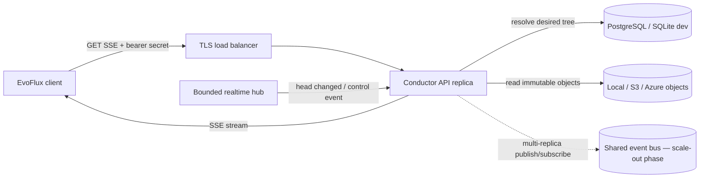
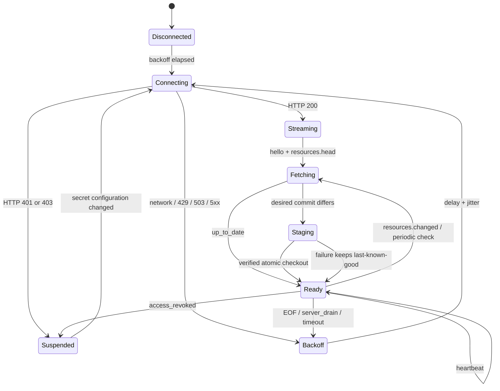

# EvoFlux ↔ Conductor realtime integration

Status: **Conductor implemented; EvoFlux integration pending**
Protocol: `evoflux.realtime.v1`

This document is the implementation contract for adding Conductor connectivity to EvoFlux later. This change does not modify EvoFlux.

## Architecture decision

Use two independent paths:

- **Control plane, Conductor → EvoFlux:** long-lived Server-Sent Events (SSE) carrying liveness and head invalidations only.
- **Data plane, EvoFlux ↔ Conductor:** short, retryable HTTPS smart fetch, immutable object downloads, registration, inventory and telemetry batches.

SSE is preferred over WebSocket for the current one-way catalog stream: it has native HTTP proxy behavior, a smaller protocol surface, simple heartbeats/reconnects, and no per-connection polling task. EvoFlux must use an SSE client that supports custom headers; browser `EventSource` cannot attach the required bearer token.



## Implemented endpoints

| Endpoint | Purpose | Required scope |
|---|---|---|
| `GET /api/v1/realtime/events` | Realtime SSE stream | `subscribe_resources` |
| `POST /api/v1/resources/fetch` | Authoritative Git-style `have` negotiation and desired checkout plan | `subscribe_resources` |
| `GET /api/v1/resources/{resource_id}/versions/{version_id}/artifact` | Immutable content-addressed Bundle object | `subscribe_resources` |
| `GET /api/v1/subscribe/resources` | Legacy full snapshot; compatibility only | `subscribe_resources` |
| `POST /api/v1/client/register` | Idempotent installation registration and project policy bootstrap | `subscribe_resources` |
| `POST /api/v1/client/heartbeat` | Installation presence heartbeat | `subscribe_resources` |
| `PUT /api/v1/client/inventory` | Authoritative applied/drift/trust inventory | `subscribe_resources` |
| `POST /api/v1/telemetry/batch` | Privacy-safe request/model/tool telemetry | `report_telemetry` |
| `POST /api/v1/usage/resources` | Idempotent resource outcome batch | `report_telemetry` |

Request:

```http
GET /api/v1/realtime/events HTTP/1.1
Host: conductor.example.com
Authorization: Bearer evc_<prefix>_<secret>
Accept: text/event-stream
Cache-Control: no-cache
```

Never place the secret in a URL, query parameter, log field, metric label, crash report, or analytics payload. Production connections must use TLS.

## Connection lifecycle

1. EvoFlux opens the SSE request with its connection secret.
2. Conductor validates the token hash, expiry, owner status, and scope.
3. Conductor applies global and per-secret admission limits.
4. The stream sends `control.hello`.
5. The stream sends `resources.head`; EvoFlux calls `POST /api/v1/resources/fetch` with its active commit and managed `have` set.
6. EvoFlux downloads only missing immutable objects, verifies and stages the complete desired tree, then switches the active generation atomically.
7. Later `resources.changed` events are coalesced into another smart fetch. Events never mutate the worktree directly.
8. Conductor sends `control.heartbeat` every configured interval (20 seconds by default).
9. EOF or network failure triggers reconnect with exponential backoff and jitter; the last-known-good generation remains active.

Every reconnect triggers a cheap authoritative commit negotiation. Event IDs are ordered within a running Conductor process but are not a persistent replay log. EvoFlux must not assume that `Last-Event-ID` can recover events across restarts. Missing events cannot lose state because the next fetch derives a complete member-specific tree.



## Event contract

Each SSE frame uses the SSE `event` field and a JSON `data` envelope:

```json
{
  "protocol": "evoflux.realtime.v1",
  "sequence": "42",
  "emitted_at": "2026-08-09T10:30:00Z",
  "data": {}
}
```

`sequence` is a decimal string so clients do not lose precision in JavaScript.

### `control.hello`

```json
{
  "connection_id": "64d89e88-d30b-47ea-b51e-377769adb42d",
  "heartbeat_seconds": 20,
    "snapshot_mode": "smart_fetch",
    "capabilities": [
    "resources.fetch",
    "resources.changed",
    "access.revoke"
  ]
}
```

### `resources.head`

```json
{
  "reason": "initial",
  "fetch_url": "/api/v1/resources/fetch"
}
```

This is an instruction to negotiate, not a catalog snapshot. Conductor does not read or serialize authored files while opening an SSE connection.

### `resources.changed`

```json
{
  "reason": "upsert",
  "resource_id": "b9c1409a-bddc-4683-8671-b89d253bfd5c",
  "fetch_url": "/api/v1/resources/fetch"
}
```

`reason` is currently `upsert` or `delete`. The `resource_id` is a hint for observability only. The client must fetch the complete desired commit instead of applying this hint as a mutation. Access is re-evaluated during fetch, so the resulting checkout contains only released resources the secret owner may consume.

### Control events

| Event | Client action |
|---|---|
| `control.heartbeat` | Record liveness; no catalog mutation |
| `control.access_revoked` | Close, erase the token from active memory, and suspend automatic reconnect until configuration changes |
| `control.server_drain` | Close and reconnect after `retry_after_ms` plus jitter |
| `control.resync_required` | Call `fetch_url`; keep the stream open unless it closes |

The stream also emits SSE comments every 10 seconds to prevent idle proxy timeouts.

## Usage outcome reporting

EvoFlux reports operational outcomes after an execution. Do not send prompts, responses, tool arguments, credentials or other content.

```http
POST /api/v1/usage/resources HTTP/1.1
Host: conductor.example.com
Authorization: Bearer evc_<prefix>_<secret>
Content-Type: application/json
```

```json
{
  "events": [
    {
      "event_id": "95177f7e-243f-464b-a9b5-9f70878fdbe4",
      "resource_id": "b9c1409a-bddc-4683-8671-b89d253bfd5c",
      "resource_version": "1.3.0",
      "session_id": "local-session-42",
      "outcome": "success",
      "duration_ms": 1840,
      "tokens_in": 820,
      "tokens_out": 210,
      "occurred_at": "2026-08-09T10:35:00Z"
    }
  ]
}
```

Response:

```json
{
  "accepted": 1,
  "duplicates": 0
}
```

Rules:

- Ingestion batches contain 1–100 events. An empty `events` array performs an
  authenticated, read-only delivery-summary refresh for the current member and
  installation; it does not insert a telemetry event.
- `event_id` is generated once by EvoFlux and retained across retries.
- The same event ID is counted once; retry duplicates increment `duplicates`.
- Member identity is always the authenticated secret owner. There is no `user_id` request field.
- The resource must be published and accessible to that member.
- Valid outcomes are `success`, `failure` and `cancelled`.
- Events older than 90 days or over five minutes in the future are rejected.
- `duration_ms` is capped at 24 hours; token counts are capped at 100 million per event.
- Validation is atomic for a submitted batch. EvoFlux acknowledges events only
  when `accepted + duplicates` equals the submitted event count.

An empty refresh returns `accepted: 0`, `duplicates: 0`, and a `summary` over
the trailing 30 days using Conductor `received_at`. The summary is scoped to the
authenticated member and requested installation. It reports both all delivered
events and the governed-resource-attributed subset used by project analytics;
these populations are intentionally different from EvoFlux's locally retained
OTEL activity.

Recommended EvoFlux queue behavior:

1. Write the event to a bounded local durable queue after execution.
2. Send up to 100 events per request.
3. Delete accepted and duplicate events from the queue.
4. Log rejected event IDs and reasons locally without including sensitive execution content.
5. Apply exponential backoff with jitter on network errors, `429`, `503` and `5xx`.

## Reconnect and error policy

| Result | EvoFlux behavior |
|---|---|
| `200 text/event-stream` | Parse the stream |
| `401` | Secret is invalid, expired, revoked, or its owner is disabled; stop automatic reconnect |
| `403` | Secret lacks `subscribe_resources`; stop and ask for a correctly scoped secret |
| `429` | Per-secret connection limit; honor `Retry-After` |
| `503` | Replica capacity reached; honor `Retry-After` and retry another replica if available |
| Other `5xx`, EOF, timeout | Exponential backoff with full jitter |

Recommended retry delay: `random(0, min(30s, 500ms × 2^attempt))`. Reset the attempt counter only after an up-to-date response or a verified checkout is committed. Treat a missing heartbeat for `3 × heartbeat_seconds` as a dead connection.

## Client processing rules

- Parse frames incrementally; do not buffer the full response body.
- Validate `protocol` before accepting a fetch instruction.
- Coalesce invalidations through one consumer; never mutate active resource files from an SSE handler.
- Persist the managed resource registry, verified object cache and active commit; keep bearer secrets in the existing protected secret store.
- Preserve the last-known-good generation during reconnect or a failed checkout. Mark connectivity stale after the liveness timeout without disabling verified local files.
- Enforce bundle, file-count, expanded-size and per-file limits before activation.
- Run a periodic smart fetch in addition to SSE so access-policy changes converge even if an invalidation is missed.

## Resource smart-fetch data plane

Realtime carries invalidation metadata, not authored file bytes. `POST /v1/resources/fetch` resolves the complete member-visible Agent, Skill and Plugin tree but returns only changed entries and missing immutable objects. EvoFlux verifies a complete staging generation before one atomic activation; inventory acknowledgement occurs only after activation.

The exact request/response schema, outer commit hash, managed tombstone rule, download verification and required client checkout algorithm are normative in [resource-fetch-protocol.md](resource-fetch-protocol.md). Bundle file identity and inner tree hashing are defined in [resource-bundle.md](resource-bundle.md).

Agent and Skill use `application/vnd.evoflux.resource+zip`; Plugin uses `application/vnd.evoflux.plugin+zip`. Object responses have digest ETags and one-year private immutable caching. Source bytes live only in the active Local, S3, Azure Blob or Git backend and are not stored in SQL. The storage provider never changes canonical keys or digests; see [object-storage.md](object-storage.md).

`GET /v1/subscribe/resources`, `/v1/resources/changes` and hydrated version JSON remain legacy compatibility surfaces. They must not be used as the consistency model by new clients.

## Conductor performance and backpressure

The implemented single-process path has these properties:

- One Tokio task per active HTTP stream, suspended while idle.
- One bounded broadcast ring shared by all clients; default capacity is 512 events.
- No catalog polling loop per client. Each stream revalidates its connection
  secret and current owner policy once per application heartbeat so missed
  revocation signals still fail closed.
- A slow receiver does not block publishers or other receivers. It receives a resync instruction and smart-fetches the current commit after lagging.
- Global and per-secret semaphores reject overload before allocating a stream.
- A separate handshake semaphore bounds concurrent authentication during reconnect storms; opening SSE performs no catalog snapshot read.
- `last_used_at` writes are throttled to at most once per five minutes per stable secret state.
- Secret revocation and member disable publish an immediate disconnect signal.

Environment controls:

| Variable | Default | Meaning |
|---|---:|---|
| `CONDUCTOR_REALTIME_MAX_CONNECTIONS` | `10000` | Maximum streams per process |
| `CONDUCTOR_REALTIME_MAX_CONNECTIONS_PER_SECRET` | `4` | Prevent one secret exhausting a replica |
| `CONDUCTOR_REALTIME_MAX_CONCURRENT_HANDSHAKES` | `256` | Bound concurrent stream authentication work |
| `CONDUCTOR_REALTIME_BROADCAST_CAPACITY` | `512` | Events retained for slow receivers |
| `CONDUCTOR_REALTIME_HEARTBEAT_SECONDS` | `20` | Application heartbeat interval, clamped to 5–300 seconds |

The 10,000 default is an admission limit, not a throughput guarantee. Validate the deployed CPU, memory, file descriptor limit, TLS proxy, database, resource payload size, and expected event frequency with a representative soak test.

Suggested acceptance test per replica:

- 10,000 idle streams for 30 minutes with no disconnect storm.
- p95 authenticated connection setup below 250 ms.
- p95 fan-out delivery below 500 ms at the expected event rate.
- bounded memory after repeatedly connecting and disconnecting clients.
- one intentionally slow client triggers only its own smart-fetch recovery.
- revoke and disable events close matching connections within one second.

## Reverse proxy requirements

Example Nginx location:

```nginx
location /api/v1/realtime/events {
    proxy_pass http://conductor;
    proxy_http_version 1.1;
    proxy_set_header Authorization $http_authorization;
    proxy_set_header Connection "";
    proxy_buffering off;
    proxy_cache off;
    proxy_read_timeout 75s;
}
```

The load balancer idle timeout must exceed `3 × heartbeat_seconds`. Raise process and proxy file-descriptor limits above the configured connection cap. Prefer HTTP/2 between EvoFlux and the edge; the upstream connection to Conductor may remain HTTP/1.1.

## Multi-replica production design

The current `RealtimeHub` is process-local and is suitable for one Conductor replica. Do not run multiple replicas and expect resource events or presence counts to cross process boundaries yet.

The scale-out phase should add:

1. PostgreSQL as the source of truth; SQLite remains a local-development option.
2. A transactional outbox row in the same transaction as each resource mutation.
3. An outbox publisher to NATS JetStream (recommended) or Redis Streams.
4. Every Conductor replica subscribes to the shared topic and publishes into its local bounded hub.
5. A stable event ID from the outbox replaces the process-local sequence.
6. Distributed presence uses short-TTL leases keyed by owner and replica, not database writes per heartbeat.
7. Graceful shutdown publishes `control.server_drain`, stops admission, and allows a bounded drain period.

This preserves at-least-once invalidation. Duplicate or missing invalidations are safe because the content-addressed desired commit, not event replay order, determines checkout state.

## Conductor resource publisher contract

Future Conductor resource mutation services must publish only after the database transaction commits:

```rust,ignore
state.realtime.publish(RealtimeSignal::ResourceUpsert {
    audience: RealtimeAudience::All,
    resource,
});
```

Use `RealtimeAudience::Owner(user_id)` for private resources. If visibility changes, publish a delete to the old audience and an upsert to the new audience. In the multi-replica phase, write an outbox event instead of directly publishing from the HTTP handler.

## Future EvoFlux checklist

The canonical Agent, Skill and Plugin file-manifest, integrity and Work/Coding/AIM scope contract is defined in [resource-bundle.md](resource-bundle.md). The required delivery/checkout algorithm is defined in [resource-fetch-protocol.md](resource-fetch-protocol.md).

- Add secure secret configuration and redaction.
- Add an incremental SSE client with custom `Authorization` header.
- Implement the lifecycle and retry state machine above.
- Validate protocol version and event schemas.
- Implement smart-fetch `have` negotiation and a durable managed registry.
- Verify artifacts and both tree hashes, then atomically switch a complete staged generation.
- Enforce dependency, Agent-team and Plugin trust rules before activation.
- Surface connected, reconnecting, stale, and suspended status to users.
- Add unit tests for fragmented SSE frames and duplicate events.
- Add integration tests for token expiry, revoke, lag recovery, interrupted checkout, rollback, proxy timeout and restart.
- Add a bounded durable usage queue and idempotent `POST /api/v1/usage/resources` batches.
- Never include member identity or execution content in usage payloads.
- Run the shared load/soak acceptance suite before enabling realtime by default.

## Project data policy

`POST /api/v1/client/register` returns the current project collection level in
`policy.collection_level`. Its `project` object also carries the server-owned
identity fields `name`, `display_name`, `description` and `logo_url`; clients
should refresh those values on every successful registration rather than cache
locally authored copies.

Collection levels:

- `L0`: telemetry ingestion is disabled; registration, heartbeat, resource delivery and inventory remain available.
- `L1`: operational metadata is enabled: outcomes, latency, tokens and resource attribution.
- `L2`: reserves the extended privacy-safe diagnostics contract for richer model, tool and failure analysis.

Conductor rejects `/api/v1/telemetry/batch` when the current project setting is
`L0`. EvoFlux must re-read the policy when it registers and must stop enqueueing
telemetry if the server returns `403`. None of the collection levels authorize
prompt text, model responses, tool arguments, credentials or local file
contents. The Admin UI manages this value under **Project settings → Data &
privacy**.
