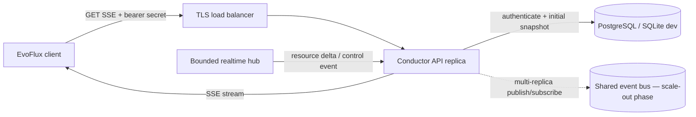
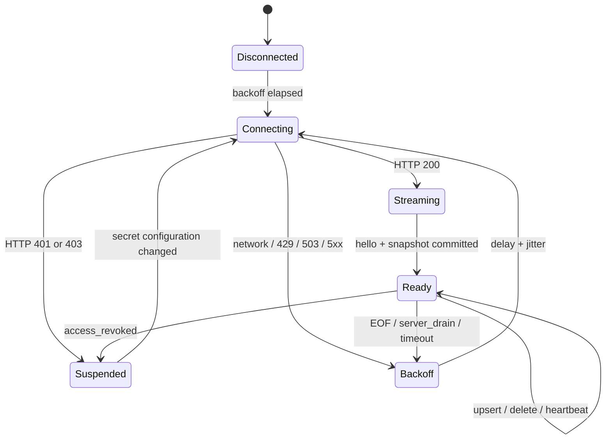

# EvoFlux ↔ Conductor realtime integration

Status: **Conductor implemented; EvoFlux integration pending**
Protocol: `evoflux.realtime.v1`

This document is the implementation contract for adding Conductor connectivity to EvoFlux later. This change does not modify EvoFlux.

## Architecture decision

Use two independent paths:

- **Control plane, Conductor → EvoFlux:** long-lived Server-Sent Events (SSE).
- **Data plane, EvoFlux → Conductor:** short, retryable HTTPS batches for inventory and telemetry in a later phase.

SSE is preferred over WebSocket for the current one-way catalog stream: it has native HTTP proxy behavior, a smaller protocol surface, simple heartbeats/reconnects, and no per-connection polling task. EvoFlux must use an SSE client that supports custom headers; browser `EventSource` cannot attach the required bearer token.



## Implemented endpoints

| Endpoint | Purpose | Required scope |
|---|---|---|
| `GET /api/v1/realtime/events` | Realtime SSE stream | `subscribe_resources` |
| `GET /api/v1/subscribe/resources` | Full snapshot and reconnect fallback | `subscribe_resources` |
| `POST /api/v1/usage/resources` | Idempotent resource outcome batch | `report_telemetry` |

Request:

```http
GET /api/v1/realtime/events HTTP/1.1
Host: conductor.example.com
Authorization: Bearer evc_<prefix>_<secret>
Accept: text/event-stream
Cache-Control: no-cache
```

Never place the secret in a URL, query parameter, log field, metric label, crash report, or analytics payload. Production connections must use TLS.

## Connection lifecycle

1. EvoFlux opens the SSE request with its connection secret.
2. Conductor validates the token hash, expiry, owner status, and scope.
3. Conductor applies global and per-secret admission limits.
4. The stream sends `control.hello`.
5. The stream sends `resources.snapshot`; EvoFlux replaces its local catalog atomically.
6. EvoFlux applies later `resources.upsert` and `resources.delete` events in arrival order.
7. Conductor sends `control.heartbeat` every configured interval (20 seconds by default).
8. EOF or network failure triggers reconnect with exponential backoff and jitter.

Every reconnect receives a new authoritative snapshot. Event IDs are ordered within a running Conductor process but are not a persistent replay log. EvoFlux must not assume that `Last-Event-ID` can recover events across restarts.



## Event contract

Each SSE frame uses the SSE `event` field and a JSON `data` envelope:

```json
{
  "protocol": "evoflux.realtime.v1",
  "sequence": "42",
  "emitted_at": "2026-08-09T10:30:00Z",
  "data": {}
}
```

`sequence` is a decimal string so clients do not lose precision in JavaScript.

### `control.hello`

```json
{
  "connection_id": "64d89e88-d30b-47ea-b51e-377769adb42d",
  "heartbeat_seconds": 20,
  "snapshot_mode": "replace",
  "capabilities": [
    "resources.snapshot",
    "resources.delta",
    "access.revoke"
  ]
}
```

### `resources.snapshot`

```json
{
  "reason": "initial",
  "resources": [
    {
      "id": "b9c1409a-bddc-4683-8671-b89d253bfd5c",
      "kind": "agent",
      "slug": "reviewer",
      "name": "Reviewer",
      "description": "Reviews proposed changes",
      "version": "1.2.0",
      "owner_user_id": null,
      "visibility": "shared",
      "status": "published",
      "payload": {},
      "published_at": "2026-08-09T10:20:00Z",
      "created_at": "2026-08-09T10:00:00Z",
      "updated_at": "2026-08-09T10:20:00Z"
    }
  ]
}
```

Replace the complete local catalog in one atomic operation. `reason` is `initial` or `lag_recovery`. A lag-recovery frame also contains `skipped_events`.

Snapshots and deltas contain only the currently published version of resources the secret owner may consume. Access is resolved from shared/private defaults plus explicit primary-role, sub-role, tag and member rules. A draft or archived resource must never be activated by EvoFlux.

### `resources.upsert`

```json
{
  "resource": {
    "id": "b9c1409a-bddc-4683-8671-b89d253bfd5c",
    "kind": "agent",
    "slug": "reviewer",
    "name": "Reviewer",
    "description": null,
    "version": "1.3.0",
    "owner_user_id": null,
    "visibility": "shared",
    "status": "published",
    "payload": {},
    "published_at": "2026-08-09T10:30:00Z",
    "created_at": "2026-08-09T10:00:00Z",
    "updated_at": "2026-08-09T10:30:00Z"
  }
}
```

Upsert by resource `id`; processing the same event twice must be harmless.

### `resources.delete`

```json
{ "resource_id": "b9c1409a-bddc-4683-8671-b89d253bfd5c" }
```

Delete by resource `id`; deleting an unknown resource must be harmless.

### Control events

| Event | Client action |
|---|---|
| `control.heartbeat` | Record liveness; no catalog mutation |
| `control.access_revoked` | Close, erase the token from active memory, and suspend automatic reconnect until configuration changes |
| `control.server_drain` | Close and reconnect after `retry_after_ms` plus jitter |
| `control.resync_required` | Pull `snapshot_url`, then reopen the stream |

The stream also emits SSE comments every 10 seconds to prevent idle proxy timeouts.

## Usage outcome reporting

EvoFlux reports operational outcomes after an execution. Do not send prompts, responses, tool arguments, credentials or other content.

```http
POST /api/v1/usage/resources HTTP/1.1
Host: conductor.example.com
Authorization: Bearer evc_<prefix>_<secret>
Content-Type: application/json
```

```json
{
  "events": [
    {
      "event_id": "95177f7e-243f-464b-a9b5-9f70878fdbe4",
      "resource_id": "b9c1409a-bddc-4683-8671-b89d253bfd5c",
      "resource_version": "1.3.0",
      "session_id": "local-session-42",
      "outcome": "success",
      "duration_ms": 1840,
      "tokens_in": 820,
      "tokens_out": 210,
      "occurred_at": "2026-08-09T10:35:00Z"
    }
  ]
}
```

Response:

```json
{
  "accepted": 1,
  "duplicates": 0,
  "rejected": 0,
  "rejections": []
}
```

Rules:

- Batch size is 1–100.
- `event_id` is generated once by EvoFlux and retained across retries.
- The same event ID is counted once; retry duplicates increment `duplicates`.
- Member identity is always the authenticated secret owner. There is no `user_id` request field.
- The resource must be published and accessible to that member.
- Valid outcomes are `success`, `failure` and `cancelled`.
- Events older than 90 days or over five minutes in the future are rejected.
- `duration_ms` is capped at 24 hours; token counts are capped at 100 million per event.
- `rejections` identifies each rejected event and a stable reason such as `resource_not_accessible`, `unknown_resource_version` or `timestamp_out_of_range`.
- Partial batch acceptance is expected. EvoFlux should drop rejected events, acknowledge accepted/duplicate events and retry only on transport/`5xx` failures.

Recommended EvoFlux queue behavior:

1. Write the event to a bounded local durable queue after execution.
2. Send up to 100 events per request.
3. Delete accepted and duplicate events from the queue.
4. Log rejected event IDs and reasons locally without including sensitive execution content.
5. Apply exponential backoff with jitter on network errors, `429`, `503` and `5xx`.

## Reconnect and error policy

| Result | EvoFlux behavior |
|---|---|
| `200 text/event-stream` | Parse the stream |
| `401` | Secret is invalid, expired, revoked, or its owner is disabled; stop automatic reconnect |
| `403` | Secret lacks `subscribe_resources`; stop and ask for a correctly scoped secret |
| `429` | Per-secret connection limit; honor `Retry-After` |
| `503` | Replica capacity reached; honor `Retry-After` and retry another replica if available |
| Other `5xx`, EOF, timeout | Exponential backoff with full jitter |

Recommended retry delay: `random(0, min(30s, 500ms × 2^attempt))`. Reset the attempt counter only after a complete initial snapshot is committed. Treat a missing heartbeat for `3 × heartbeat_seconds` as a dead connection.

## Client processing rules

- Parse frames incrementally; do not buffer the full response body.
- Validate `protocol` before accepting the snapshot.
- Build a new catalog off-thread, then atomically swap it into active state.
- Process resource events through one ordered consumer; never mutate the catalog concurrently.
- Persist only the resource catalog, not the raw bearer secret or connection ID.
- Preserve the last known-good catalog during reconnect. Mark it stale after the liveness timeout.
- Reject unexpectedly large payloads according to an EvoFlux-side configured limit.

## Conductor performance and backpressure

The implemented single-process path has these properties:

- One Tokio task per active HTTP stream, suspended while idle.
- One bounded broadcast ring shared by all clients; default capacity is 512 events.
- No database polling loop per client.
- A slow receiver does not block publishers or other receivers. It gets a fresh filtered snapshot after lagging.
- Global and per-secret semaphores reject overload before allocating a stream.
- A separate handshake semaphore bounds concurrent authentication and snapshot database work during reconnect storms.
- `last_used_at` writes are throttled to at most once per five minutes per stable secret state.
- Secret revocation and member disable publish an immediate disconnect signal.

Environment controls:

| Variable | Default | Meaning |
|---|---:|---|
| `CONDUCTOR_REALTIME_MAX_CONNECTIONS` | `10000` | Maximum streams per process |
| `CONDUCTOR_REALTIME_MAX_CONNECTIONS_PER_SECRET` | `4` | Prevent one secret exhausting a replica |
| `CONDUCTOR_REALTIME_MAX_CONCURRENT_HANDSHAKES` | `256` | Bound concurrent auth/snapshot database work |
| `CONDUCTOR_REALTIME_BROADCAST_CAPACITY` | `512` | Events retained for slow receivers |
| `CONDUCTOR_REALTIME_HEARTBEAT_SECONDS` | `20` | Application heartbeat interval, clamped to 5–300 seconds |

The 10,000 default is an admission limit, not a throughput guarantee. Validate the deployed CPU, memory, file descriptor limit, TLS proxy, database, resource payload size, and expected event frequency with a representative soak test.

Suggested acceptance test per replica:

- 10,000 idle streams for 30 minutes with no disconnect storm.
- p95 authenticated connection setup below 250 ms.
- p95 fan-out delivery below 500 ms at the expected event rate.
- bounded memory after repeatedly connecting and disconnecting clients.
- one intentionally slow client triggers only its own lag recovery.
- revoke and disable events close matching connections within one second.

## Reverse proxy requirements

Example Nginx location:

```nginx
location /api/v1/realtime/events {
    proxy_pass http://conductor;
    proxy_http_version 1.1;
    proxy_set_header Authorization $http_authorization;
    proxy_set_header Connection "";
    proxy_buffering off;
    proxy_cache off;
    proxy_read_timeout 75s;
}
```

The load balancer idle timeout must exceed `3 × heartbeat_seconds`. Raise process and proxy file-descriptor limits above the configured connection cap. Prefer HTTP/2 between EvoFlux and the edge; the upstream connection to Conductor may remain HTTP/1.1.

## Multi-replica production design

The current `RealtimeHub` is process-local and is suitable for one Conductor replica. Do not run multiple replicas and expect resource events or presence counts to cross process boundaries yet.

The scale-out phase should add:

1. PostgreSQL as the source of truth; SQLite remains a local-development option.
2. A transactional outbox row in the same transaction as each resource mutation.
3. An outbox publisher to NATS JetStream (recommended) or Redis Streams.
4. Every Conductor replica subscribes to the shared topic and publishes into its local bounded hub.
5. A stable event ID from the outbox replaces the process-local sequence.
6. Distributed presence uses short-TTL leases keyed by owner and replica, not database writes per heartbeat.
7. Graceful shutdown publishes `control.server_drain`, stops admission, and allows a bounded drain period.

This preserves at-least-once delivery. EvoFlux's idempotent upsert/delete rules make duplicate delivery safe.

## Conductor resource publisher contract

Future Conductor resource mutation services must publish only after the database transaction commits:

```rust,ignore
state.realtime.publish(RealtimeSignal::ResourceUpsert {
    audience: RealtimeAudience::All,
    resource,
});
```

Use `RealtimeAudience::Owner(user_id)` for private resources. If visibility changes, publish a delete to the old audience and an upsert to the new audience. In the multi-replica phase, write an outbox event instead of directly publishing from the HTTP handler.

## Future EvoFlux checklist

The canonical Agent, Skill and Plugin file-manifest, integrity and Work/Coding/AIM scope contract is defined in [resource-bundle-v2.md](resource-bundle-v2.md). New clients should use its additive v2 fields while retaining the v1 fallback for legacy releases.

- Add secure secret configuration and redaction.
- Add an incremental SSE client with custom `Authorization` header.
- Implement the lifecycle and retry state machine above.
- Validate protocol version and event schemas.
- Atomically persist/replace the resource catalog.
- Apply idempotent deltas through one ordered consumer.
- Surface connected, reconnecting, stale, and suspended status to users.
- Add unit tests for fragmented SSE frames and duplicate events.
- Add integration tests for token expiry, revoke, lag recovery, proxy timeout, and restart.
- Add a bounded durable usage queue and idempotent `POST /api/v1/usage/resources` batches.
- Never include member identity or execution content in usage payloads.
- Run the shared load/soak acceptance suite before enabling realtime by default.

Inventory heartbeat and general telemetry endpoints remain intentionally undeclared. Resource outcome reporting is the only implemented EvoFlux → Conductor data-plane contract. Define other batch schemas, idempotency keys, size limits and retention policies before EvoFlux sends them.
