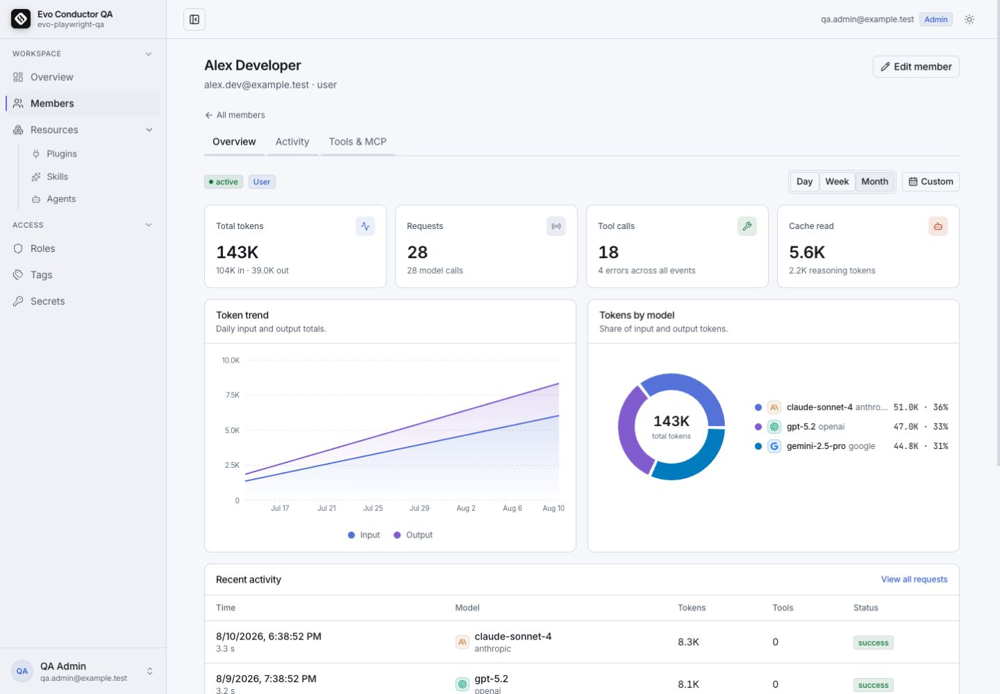
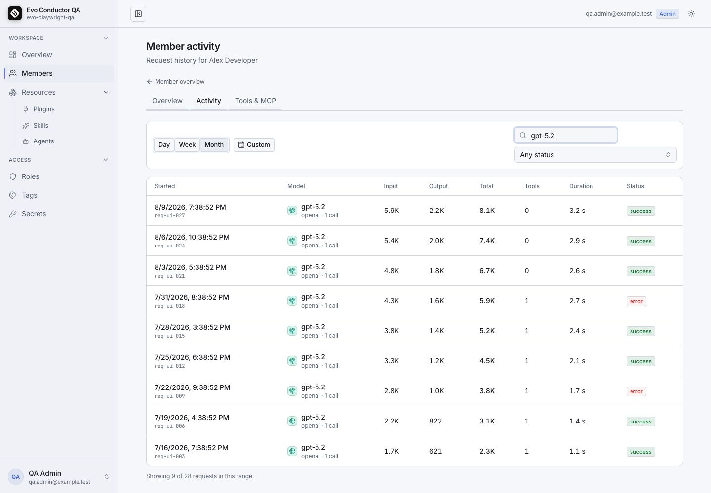
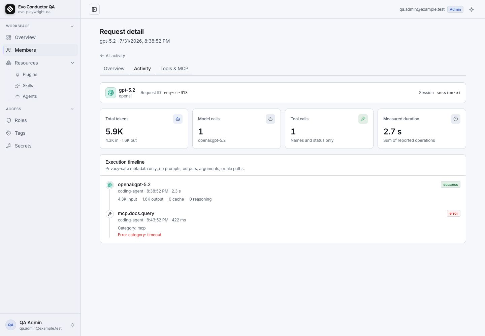
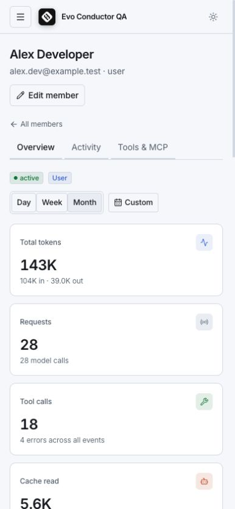
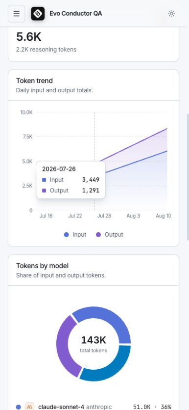

# Member usage and activity UI — QA evidence

Validated on 2026-08-10 against the local Conductor API and a seeded SQLite QA database.

The cost KPI below regressed after that run — `MemberUsageSummary` carried no
cost field, so the overview showed tokens only — and was restored when
Conductor started pricing telemetry itself. Every figure on this page — KPIs,
daily series, activity and tools — is now windowed on `received_at`, the same
clock `/analytics/resource-usage` and spend limits use, so the member view and
the admin view agree for a given range.

## Acceptance checklist

- [x] Member rows navigate to `/app/members/:userId` with mouse, Enter, and Space.
- [x] Member overview shows request, token, cost, latency, error-rate, and tool-call KPIs.
- [x] Usage charts render token trends and model/provider distribution.
- [x] Tools view renders ranked tool usage with date-range filtering.
- [x] Activity view filters request audit rows and opens request details.
- [x] Request details show model, provider, tokens, duration, cost, status, and tool events.
- [x] Desktop and 390 px mobile layouts render without horizontal overflow.
- [x] Provider icons use local SVG assets and retain an accessible text fallback.
- [x] Browser console remained free of runtime errors during the Playwright flows.

## Automated verification

```text
cargo fmt --check
cargo clippy --workspace --all-targets --all-features -- -D warnings
cargo test --workspace                         # 42 passed
bun run typecheck
bun run build
Playwright smoke/visual flows                  # passed
```

The Vite production build reports only its existing large-chunk and `__dirname` compatibility warnings.

## Screenshots

### Member overview — desktop



### Activity filtering — desktop



### Request audit detail — desktop



### Member overview — mobile



### Charts — mobile


