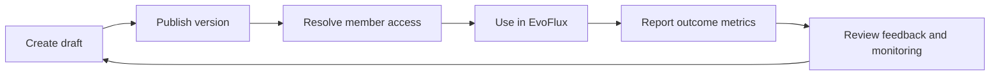

# Product design — governed resource catalog

Status: **MVP implemented in Conductor**

## Product problem

EvoFlux resources currently behave like files/configuration that members can pull, but a project needs a control plane that answers five operational questions:

1. What agents, skills and MCP servers are approved for use?
2. Which exact version is active, and what changed?
3. Who is allowed to receive each resource?
4. Who actually uses it, and does it work reliably?
5. What should the owner improve in the next version?

Conductor owns governance and measurement. EvoFlux remains the execution runtime and reports outcomes using a connection secret.

## Personas and jobs

| Persona | Job to be done |
|---|---|
| Admin | Govern the entire catalog, access boundaries and auditability |
| Contributor/resource owner | Create, version, publish and improve resources they own |
| Member | Discover permitted published resources and provide actionable feedback |
| Engineering/operations | Understand adoption, reliability, latency and reporting health |

## Product loop

The unit of governance is a stable **resource**. The unit of delivery is an immutable **resource version**.

## MVP scope

### Catalog management

- Resource kinds: agent, skill, MCP, workflow and command.
- Stable metadata: slug, name, description, owner and visibility.
- Lifecycle: `draft → published → archived`.
- Draft resource creation with an initial semantic version and JSON payload.
- Metadata editing without rewriting version history.
- Archive instead of destructive delete; history and monitoring remain queryable.

### Version governance

- Multiple immutable version records per resource.
- Version lifecycle: `draft → published → deprecated`.
- Exactly one published version per resource.
- Publishing atomically replaces the payload served to EvoFlux.
- Changelog required by product workflow, optional at API level for migration compatibility.

### Access model

- Admin can manage every resource.
- Contributor can create resources and manage/publish only resources they own.
- User consumes only published resources that match access policy.
- Shared resource with no explicit policy defaults to all active members.
- Private resource with no explicit policy defaults to owner only.
- Explicit allow subjects: all members, primary roles, sub-roles, member tags and individual members.
- Admin and owner retain access so a policy cannot orphan its resource.

The MVP intentionally supports allow rules only. Deny rules and nested policy expressions are deferred because they make policy evaluation and support substantially harder.

### Effectiveness monitoring

- EvoFlux sends idempotent batches of usage outcomes.
- Member identity is derived from the connection-secret owner, never accepted from the request body.
- Measures: executions, successes, failures, success rate, duration, tokens and active members.
- Views: daily execution chart and per-member adoption table for 7, 30 or 90 days.
- Raw event IDs prevent retry duplication.

### Feedback

- One current rating/comment per member and resource.
- A later submission updates the member's prior feedback.
- Feedback is associated with the published version at submission time.
- Owners/admins see member feedback and aggregate rating.

## Permission matrix

| Capability | Admin | Contributor owner | Contributor non-owner | User |
|---|---:|---:|---:|---:|
| List accessible published resources | ✓ | ✓ | ✓ | ✓ |
| List all drafts/archived resources | ✓ | Own only | — | — |
| Create resource | ✓ | ✓ | — | — |
| Edit metadata/access | ✓ | Own only | — | — |
| Create/publish version | ✓ | Own only | — | — |
| Archive | ✓ | Own only | — | — |
| View monitoring/member feedback | ✓ | Own only | — | — |
| Submit feedback | When accessible | When accessible | When accessible | When accessible |

## Success metrics

Product health should be reviewed using:

- Catalog adoption: published resources used by at least one member in 30 days.
- Active adoption: unique members per resource and per version.
- Reliability: success rate and failure count.
- Performance: average execution duration and token volume.
- Feedback quality: response rate and average rating.
- Governance hygiene: drafts older than 30 days, published versions without changelog, archived-but-still-reported usage.

The MVP exposes resource-level metrics. Portfolio-level ranking and governance hygiene reports are the next product slice.

## Data and privacy decisions

- Usage stores operational metadata, not prompts, responses or tool arguments.
- `user_id` comes from authenticated connection context.
- Event time is accepted only within a bounded 90-day window and five-minute future skew.
- Batch size is limited to 100; payload and text fields are bounded.
- Archive preserves audit history.
- Production must define raw-event retention before broad rollout; recommended initial retention is 90 days followed by daily aggregates.

## Out of scope for this MVP

- Marketplace discovery across projects.
- Approval workflow requiring a second reviewer.
- Rollback button; publishing an older payload as a new version is the safe interim process.
- Deny/conditional access rules.
- Cost calculation tied to model-provider price tables.
- Prompt/response capture or qualitative trace inspection.
- Distributed event bus/outbox for multiple Conductor replicas.
- EvoFlux-side implementation.

## Next roadmap

1. Portfolio monitoring: top/bottom resources, adoption funnel and stale drafts.
2. Approval gates and separation of author/publisher for regulated projects.
3. Version comparison, rollback-as-new-version and release notes.
4. Daily aggregate jobs, retention controls and export.
5. Transactional outbox + NATS JetStream for multi-replica delivery.
6. EvoFlux inventory reconciliation and client version compliance.
