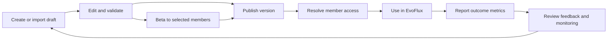

# Product design — governed resource catalog

Status: **Catalog, Resource Studio, package delivery, Beta targeting and Analytics Studio implemented; smart-fetch client migration and production hardening remain**

## Product problem

EvoFlux resources currently behave like files/configuration that members can pull, but a project needs a control plane that answers five operational questions:

1. What agents, standalone Skills and Plugins are approved for use?
2. Which exact version is active, and what changed?
3. Who is allowed to receive each resource?
4. Who actually uses it, and does it work reliably?
5. What should the owner improve in the next version?

Conductor owns governance and measurement. EvoFlux remains the execution runtime and reports outcomes using a connection secret.

## Personas and jobs

| Persona | Job to be done |
|---|---|
| Admin | Govern the entire catalog, access boundaries and auditability |
| Contributor/resource owner | Create, version, publish and improve resources they own |
| Member | Discover the permitted released version (selected Beta or Published) and provide actionable feedback |
| Engineering/operations | Understand adoption, reliability, latency and reporting health |

## Product loop

The unit of governance is a stable **resource**. The unit of delivery is an immutable **resource version**.

## MVP scope

### Catalog management

- Resource kinds: agent, standalone skill, Portable Agent Plugin, workflow and command.
- A Portable Agent Plugin is the only centrally governed Plugin resource. One package may contribute
  several Skills and declared tool servers.
- Stable metadata: immutable project ID and resource ID, plus project-scoped slug, name, description,
  owner and visibility. EvoFlux reconciles by `(project_id, resource_id)`, never by kind/slug.
- Administrative lifecycle: `draft → published → deprecated → archived`; the version panel separately
  shows Draft/Beta/Published/Deprecated release state.
- Draft creation from a kind guide/template, direct source upload or safe ZIP import.
- Server-owned editable source workspace; Save does not distribute content.
- Metadata editing without rewriting version history.
- Archive instead of destructive delete; history and monitoring remain queryable.

### Resource Studio and package validation

- Kind guides follow EvoFlux's real contracts: Agent `.md` frontmatter/body, Skill `SKILL.md` bundle and
  Agent Plugins 1.0 `plugin.json` package.
- Upload accepts a direct kind source or ZIP; plugin also accepts `.evoplugin`. Safe extraction rejects
  traversal, collisions, symlinks, unsupported entries and archive bombs before draft creation.
- A structurally safe but invalid package opens as a repairable Draft with errors/warnings tied to file,
  line/field, correction and guide section. Errors and probable embedded secrets block release.
- Monaco editor follows EvoFlux Plugin Center: responsive file tree, syntax modes, dirty/saved/error
  state, keyboard save, create/rename/delete, validation and jump-to-diagnostic.
- UTF-8 source is editable. Binary assets remain visible and versioned without being decoded in the
  browser. The API confines all paths and enforces file, entry and total-size limits.

### Version governance

- Multiple immutable version records per resource.
- One mutable Draft produces immutable versions. Separate Beta and Published channel bindings point at
  immutable version IDs; a released version with no active binding is Deprecated for distribution.
- Release version mode defaults to Auto: first release `0.1.0`, then a server-calculated patch increment
  from the highest allocated SemVer precedence. Manual override requires a unique, strictly greater valid
  SemVer 2.0 value.
- Save and validation do not increment a version. Failed releases consume no version, and concurrent
  releases cannot allocate the same value.
- At most one active Beta and exactly zero or one active Published version per resource.
- Publishing creates an immutable content-addressed payload or ZIP and atomically replaces the artifact
  served through the selected release channel to EvoFlux.
- SQL stores only object keys, digests, sizes and manifests; authored files and logos use Local, S3,
  Azure Blob or Git storage.
- Plugin versions record package identity, schema version, artifact size, SHA-256 and minimum compatible
  EvoFlux version.
- Changelog required by product workflow, optional at API level for migration compatibility.
- Beta targets explicit active member IDs and cannot broaden the normal access policy. Selected eligible
  members receive Beta; other eligible members receive Published. Removing a target falls back to
  Published or removes desired state when no Published version exists.
- Promoting Beta preserves its immutable bytes and digest. Editing any released version creates a new
  Draft rather than mutating history.
- A Plugin artifact's `plugin.json.version` always equals its Conductor semantic version; Auto previews
  and applies the manifest bump atomically before validation and digesting.

### Access model

- Admin can manage every resource.
- Contributor can create resources and manage/publish only resources they own.
- User consumes only the server-resolved Beta or Published version that matches access policy.
- Shared resource with no explicit policy defaults to all active members.
- Private resource with no explicit policy defaults to owner only.
- Explicit allow subjects: all members, primary roles, sub-roles, member tags and individual members.
- Admin and owner retain access so a policy cannot orphan its resource.

The MVP intentionally supports allow rules only. Deny rules and nested policy expressions are deferred because they make policy evaluation and support substantially harder.

### Effectiveness monitoring

- EvoFlux sends idempotent batches of usage outcomes.
- Member identity is derived from the connection-secret owner, never accepted from the request body.
- Managed usage is attributed by immutable project/resource/version identity to Agent, standalone Skill,
  Plugin and Plugin-contributed Skill/tool relations; same-name local content is not credited.
- Measures distinguish Requests, overlapping Resource uses, Model calls and Tool calls. They include
  success/error/cancelled, separated token categories, estimated cost/source, duration and active members.
- Filters cover preset/custom time range, member, recorded role/sub-role/tag, resource kind/version,
  provider/model, outcome/error, tool and installation.
- Views include KPI totals and per-request averages, request/token/cost trends, provider/model and
  Agent/Skill/Plugin distributions, success/error/duration analysis, member/resource rankings, activity
  and privacy-safe request detail.
- Raw event IDs prevent retry duplication.

### Portfolio analytics and saved views

- Analytics Studio composes ordered KPI, line, area, bar, stacked-bar, donut and table widgets from an allowlisted metric/dimension catalog.
- Dashboard definitions persist layout, density, relative/custom date range, comparison mode and typed telemetry filters. They cannot contain SQL, expressions or arbitrary query keys.
- Every view is project-scoped and owner-attributed. `private` views are visible to their owner and project admins; `shared` views are readable by telemetry-capable project contributors.
- Contributors can change only views they own. Project admins can audit and manage every project view.
- Updates and deletes require the last-read revision; stale writers receive `409 Conflict` instead of overwriting a newer dashboard.
- The console API is `GET/POST /api/analytics/views` plus `GET/PUT/DELETE /api/analytics/views/{id}`. `PUT` is a complete replacement and `DELETE` carries `?revision=<last-read>`.

### Feedback

- One current rating/comment per member and resource.
- A later submission updates the member's prior feedback.
- Feedback is associated with the published version at submission time.
- Owners/admins see member feedback and aggregate rating.

## Permission matrix

| Capability | Admin | Contributor owner | Contributor non-owner | User |
|---|---:|---:|---:|---:|
| List accessible released resources | ✓ | ✓ | ✓ | ✓ |
| List all drafts/archived resources | ✓ | Own only | — | — |
| Create resource | ✓ | ✓ | — | — |
| Edit metadata/access | ✓ | Own only | — | — |
| Create/publish version | ✓ | Own only | — | — |
| Release Beta to explicit eligible members | ✓ | Own only for non-executable resources | — | — |
| Publish executable Plugin version | ✓ | — | — | — |
| Archive | ✓ | Own only | — | — |
| View monitoring/member feedback | ✓ | Own only | — | — |
| Read shared analytics views | ✓ | ✓ | ✓ | — |
| Create/update own analytics views | ✓ | ✓ | ✓ | — |
| Manage another member's analytics view | ✓ | — | — | — |
| View own personal usage audit | Own | Own | Own | Own |
| View another member's usage audit | ✓ | Policy decision pending | — | — |
| Submit feedback | When accessible | When accessible | When accessible | When accessible |

The Plugin publication row is the target security policy. Current source still permits an owner
Contributor to release a Plugin, so Admin-only publication remains a tracked REQ-010 hardening gap.

## Success metrics

Product health should be reviewed using:

- Catalog adoption: released resources used by at least one member in 30 days, segmented by channel.
- Active adoption: unique members per resource and per version.
- Reliability: success rate and failure count.
- Performance: average/p95 duration, model calls, token categories and estimated cost per request.
- Resource effectiveness: attributed use, failures and cost by Agent/Skill/Plugin version and member role.
- Feedback quality: response rate and average rating.
- Governance hygiene: drafts older than 30 days, published versions without changelog, archived-but-still-reported usage.

The MVP exposes resource-level and portfolio-level analytics. Governance hygiene reports remain the next product slice.

## Data and privacy decisions

- Usage stores operational metadata, not prompts, responses or tool arguments.
- Saved views store only typed presentation/query configuration; they never store telemetry results, prompt content or executable query text.
- `user_id` comes from authenticated connection context.
- Project/resource/version attribution comes from managed IDs previously issued by Conductor; member
  role dimensions are stamped from server-owned membership state rather than client claims.
- Request, resource, model and tool grains remain separate so retries and overlapping resource
  attribution do not multiply totals.
- Event time is accepted only within a bounded 90-day window and five-minute future skew.
- Batch size is limited to 100; payload and text fields are bounded.
- Archive preserves audit history.
- Plugin credential values and mutable `PLUGIN_DATA` remain on each EvoFlux installation and are never
  part of a Conductor artifact, manifest or inventory report.
- EvoFlux ownership markers, managed locations, Plugin installation mappings and inventory retain the
  delivering project ID. Switching the active project isolates and disables the previous project's
  managed resources instead of relabeling or adopting them.
- Production must define raw-event retention before broad rollout; recommended initial retention is 90 days followed by daily aggregates.

## Out of scope for this MVP

- Marketplace discovery across projects.
- Approval workflow requiring a second reviewer.
- Rollback button; publishing an older payload as a new version is the safe interim process.
- Deny/conditional access rules.
- Budget enforcement or invoice reconciliation; the dashboard still shows source-labelled estimates and
  unpriced calls.
- Prompt/response capture or qualitative trace inspection.
- Distributed event bus/outbox for multiple Conductor replicas.
- Automatic activation of an executable Plugin without local EvoFlux trust review.
- Distribution of EvoFlux legacy Python hooks; only Portable Agent Plugins 1.0 are governed here.
- Percentage, tag, cohort or scheduled canary rollout; V1 Beta uses explicit member IDs only.
- Collaborative editing, arbitrary server filesystem browsing and Git/registry import.

## Next roadmap

1. Governance hygiene: stale drafts, unused releases and unresolved delivery failures.
2. Approval gates and separation of author/publisher for regulated projects.
3. Version comparison, rollback-as-new-version, release notes and richer Beta cohorts.
4. Daily aggregate jobs, retention controls and export.
5. Transactional outbox + NATS JetStream for multi-replica delivery.
6. Complete fleet inventory/compliance views, dropped-event reporting and aggregate-backed analytics.
7. Migrate EvoFlux from cursor delivery to atomic smart-fetch generation checkout, then add packaged
   two-repository security/convergence E2E, Plugin publication hardening and streaming artifact delivery.
